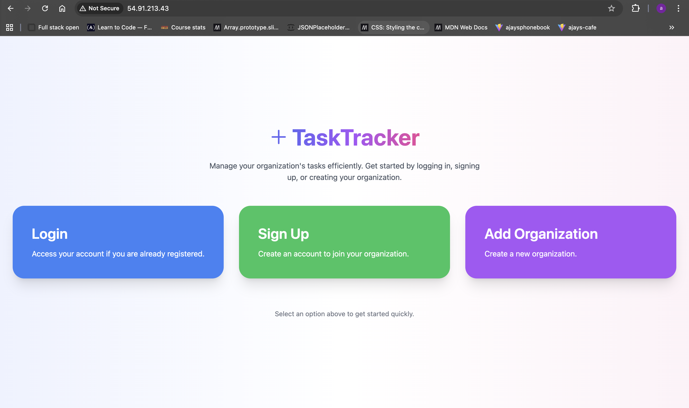
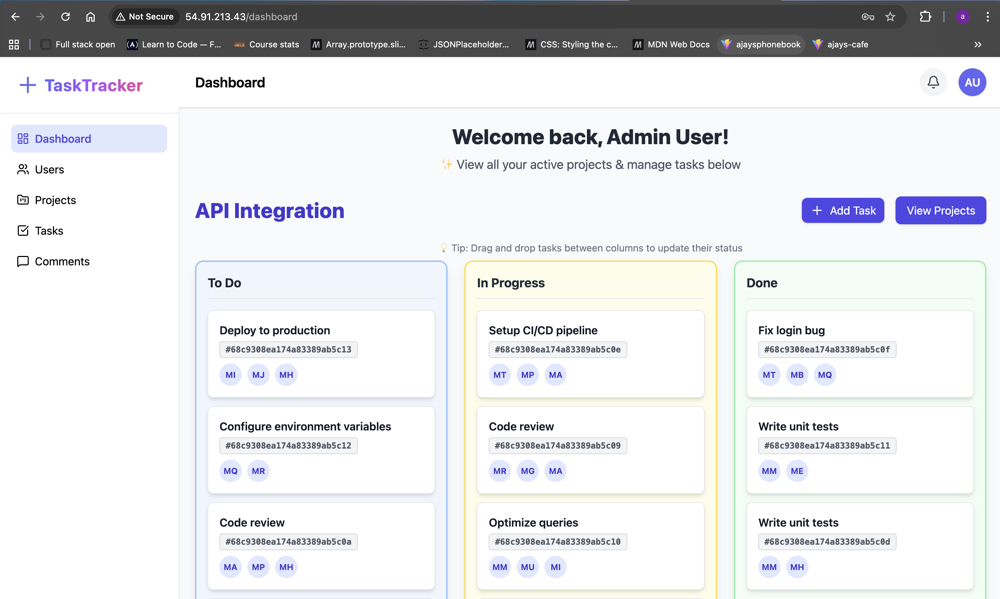

# TaskTracker DevOps Platform

Cloud deployment of the TaskTracker full-stack application using **AWS, Docker, Kubernetes (k3s), Terraform, Jenkins, and MongoDB Atlas**.

## Overview

This repository focuses on the DevOps and cloud deployment side of **TaskTracker**, a team task management application originally built with:

- React + TypeScript
- Node.js + Express + TypeScript
- MongoDB + Mongoose
- Socket.IO

The goal of this project was to take an existing full-stack app and redeploy it in a more production-oriented environment using modern cloud and DevOps tools.

## What this project demonstrates

- Dockerized frontend and backend
- Local multi-container testing with Docker Compose
- AWS infrastructure provisioning with Terraform
- EC2 bootstrap automation with user data
- Container image storage with Amazon ECR
- Kubernetes deployment with k3s
- Jenkins-based CI/CD pipeline setup
- Public cloud deployment on AWS

## Deployment Summary

The application was deployed to **AWS EC2** and later run on **k3s Kubernetes**.

### Cloud architecture
- **AWS EC2** for compute
- **Terraform** for infrastructure provisioning
- **Docker** for containerization
- **Amazon ECR** for container image registry
- **k3s** for Kubernetes orchestration
- **Jenkins** for CI/CD automation
- **MongoDB Atlas** as the external database

### Application flow
Users → EC2 Public IP → Kubernetes Ingress → Frontend / Backend → MongoDB Atlas

## Live Deployment

**Live deployment at the time of testing:**  
`http://54.91.213.43/`

### Landing Page  


### Dashboard  


### DevOps / Cloud
- AWS EC2
- Terraform
- Docker
- Docker Compose
- Amazon ECR
- Kubernetes (k3s)
- Jenkins
- AWS Systems Manager Session Manager
- Nginx

## Local Development

### Run locally
```bash
docker compose build
docker compose up